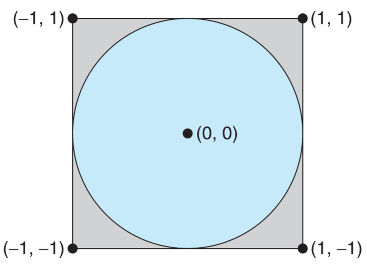
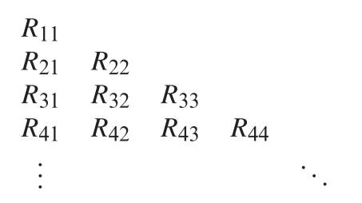

# Calculation of PI

## Background

Figure 1 below shows a circle ewith radius $r = 1$ inscribed within a square. The area of the circle to the area of the squre is
$$
ratio = \dfrac{Area of Circle}{Area of Square} = \dfrac{\pi*r^2}{2*r^2} = \dfrac{\pi}{4}
$$
 We can compute ratio to obtain the value $\pi$.
 
 

## Statistical Simulation Methods

### Monte Carlo

 Monte Carlo methods utilize a sequences of random numbers to perform the simulation.

 First, we generate a series of random points as simple(x, y) coordinates (must within the square).
 Then, calculate the number of points in circle.
 We can estimate the value of $\pi$
 $$ \pi = 4*\dfrac{n}{m} $$

 m: Total number of points

 n: the number of points in circle

## Intergration Methods

We calculate the area of circle using
$$
f(x) = \sqrt{1-x^2}
$$
to obtain the area of the $\dfrac{1}{4}$ circle. Then divide $\dfrac{1}{4}$ area of the square to get the ratio.

### Romberg Integration

Based on the composite Trapezoid Rule
$$
\int_a^bf(x)dx = \dfrac{h}{2}(y_0+y_m+2\sum_{i=1}^{m-1}y_i)+c_2h^2+c_4h^4+c_6h^6+...
$$
Use equation below to calculate it more efficiently, for j = 2, 3, ...
$$
R_{j1} = \dfrac{1}{2}R_{j-1,1}+h_j\sum_{i=1}^{2^{j-2}}f(a+(2i-1)h_j)
$$
The Extraploation

$$
R_{jk} = \dfrac{4^{k-1}R_{j,k-1}-R_{j-1,k-1}}{4^{k-1}-1}
$$

and $R_{jj}$ is the best approximation for the definite intergral

### Guassian Quadrature

## Reference

 1. [Module for Monte Carlo Pi](http://mathfaculty.fullerton.edu/mathews/n2003/montecarlopimod.html)

 2. Numerical Analysis 3rd Eidition by Timothy Sauer, chapter 5 Numerical Differentiation and Integration
