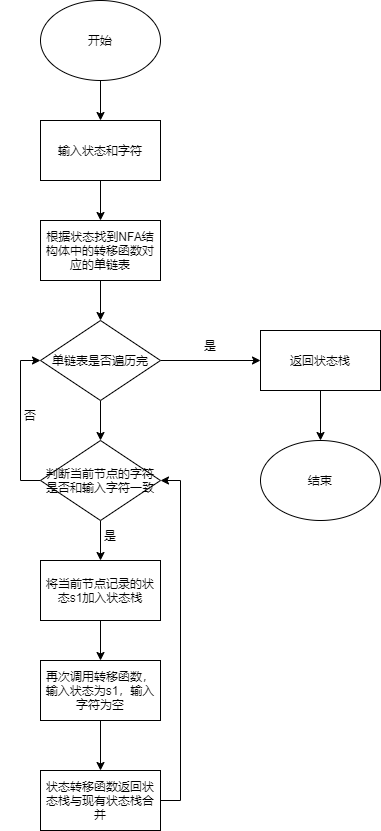

# NFA program for identifying character strings

## Homework

Understand the working principle of NFA, design a suitable data structure or class to represent the NFA shown in the figure above, and require the design to be as versatile as possible.

The NFA:


## Main idea


## Shift Function for NFA



## Usage

Compile files:
```
    gcc -o nfa nfa.c
```

Usage:

```
Usage: nfa.exe [options]
General Options:
    -h, --help      Show help
    -s, string      The string to be recognized.
    -f, -file       The NFA configuration file.
```

## Format Example for NFA Configuration file

state_number:
4
states:
q1,q2,q3,q4,
start_state:
q1
accept_state_number:
1
accept_state(s):
q4,
alphabet_number:
2
alphabets:
1,0,
shift_function:
current_state,next_state,input_alphabet
q1,q1,0,
q1,q1,1,
q1,q2,1,
q2,q3,0,
q2,q3,epsilon,
q3,q4,1,
q4,q4,0,
q4,q4,1,